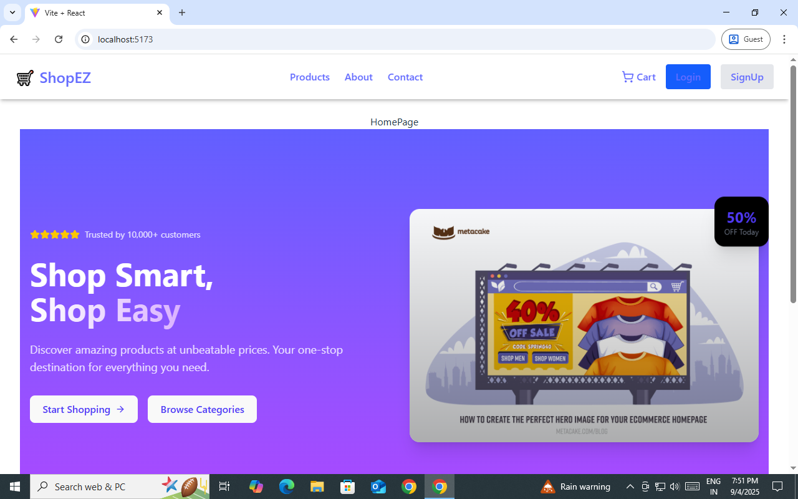
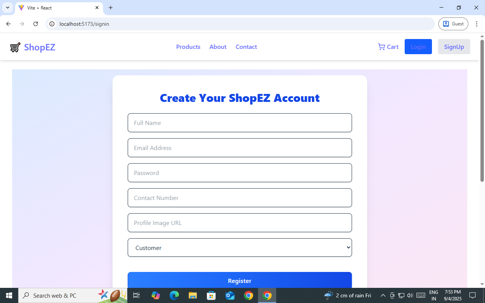
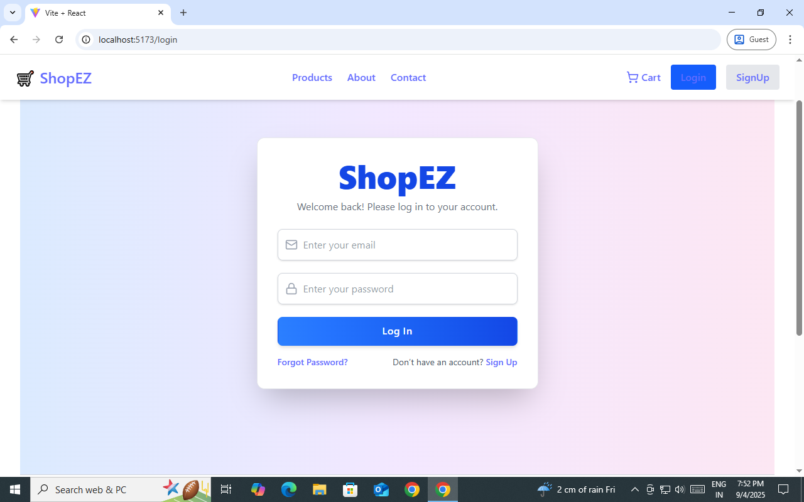

# ShopEZ
This is ShopEz an ecommerce Project for MERN Training

# Project Title







## 🚀 Features

- 👤 Multi-tenant support: Multiple vendors can list their own products
- 🛒 Add to cart functionality
- ✍️ Customers can leave reviews on products
- 🔐 User authentication (Login/Register)
- 📦 Product management for sellers

## 📥 Installation / Download

```bash
git clone https://github.com/harshitdxt/ShopEZ.git
cd ShopEZ

##   SetUp Frontend
cd frontend
npm install
npm run dev  # or npm start

##   SetUp Backend
cd backend
npm install
npm run dev  # or npm start

